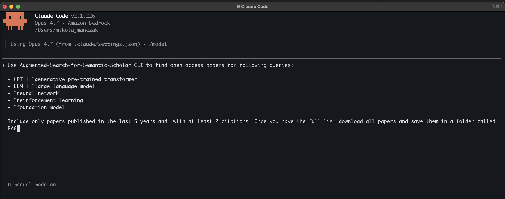

## Context

[Semantic Scholar](https://www.semanticscholar.org/) is an open-access academic search engine developed by the Allen Institute for AI. 
It helps researchers discover relevant papers and explore citations.

## Problem

Exploratory research (or constructing a RAG) often requires performing multiple searches for multiple phrases. Doing this can be time consuming and also results in overlapping results (duplicates).

## Solution

This tool automates the process by:
- UI to enter all queries at once
- Searching Semantic Scholar for each phrase
- Combining all results
- Removing duplicates
- Returning a single, clean list

## Web

Web client is publicly available at [https://mikomanczak.github.io/Augmented-Search-for-Semantic-Scholar](https://mikomanczak.github.io/Augmented-Search-for-Semantic-Scholar) 

Note that this hosted website uses Semantic Scholar without an API key. Semantic Scholar limits unauthenticated users to a shared rate limit of 1,000 requests per second, so searches performed through this website may occasionally fail.

A more reliable way to use the web client is to:

1. [Request an API key](https://www.semanticscholar.org/product/api#api-key)
2. Clone this repository
3. Save your API key in src/web/.env file
4. Run the web client locally

## Command Line Interface (CLI)

This tool is also available as a CLI. It's presumably less convenient (and more error prone) for human users but it's easier to use for agentic systems such as Claude Code or OpenAI's Codex. To use with such a tool:

1. Clone this repository
2. (Optionally) request API key and save it in src/cli/.env file 
3. Ask your agent to perform search

## Publication

An early version of this tool was used in _"Methodology for AI-Based Search Strategy of Scientific Papers: Exemplary Search for Hybrid and Battery Electric Vehicles in the Semantic Scholar Database"_ 

[https://www.mdpi.com/2304-6775/12/4/49](https://www.mdpi.com/2304-6775/12/4/49)
